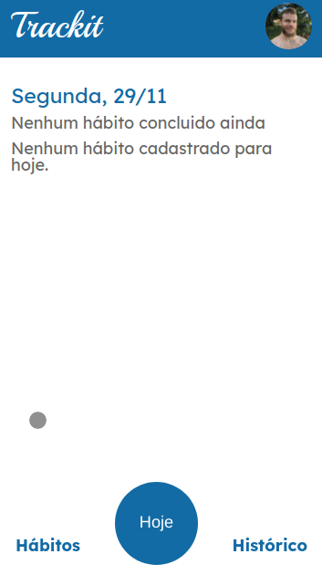

# TrackIt

Do you feel like you need help creating new good habits? This app is for you!

</br>

<p  align='center'>
</br>

</p>
</br>

Try it out now at https://projeto-10-trackit-woad.vercel.app/

## About

This is an application that helps people create new habits using the basic principle of repetition. With it you will be able to register behaviors that you want to transform in habits, choose on which day of the week you want to do it and keep on track of your progress.

Some of the features are:

- Sign Up;
- Login;
- Main page with information about the habits that are registered for the day, which you already did, which you still need to do, the number of days in sequence you did it and your record of days in a row doing it;
- Habits page where you can manage your habbits. You can delete or include a new one any time you want;
- Progress bar that shows you the percentage of habits registered for the day you already concluded.

## Next features

- History page where you can keep on track of your progress with a calendar that shows the days you managed to complete all your habits in green and the days didn't in red.

## Technologies

The following tools and frameworks were used in the construction of the project:<br>

<p>


## How to run

1. Clone this repository

```bash
git clone https://github.com/leoguzi/trackit.git
```

2. Install dependencies

```bash
npm i
```

3. Run the front-end with

```bash
npm start
```

4. You can optionally build the project running

```bash
npm run build
```

5. Finally access http://localhost:3000 on your favorite browser.
